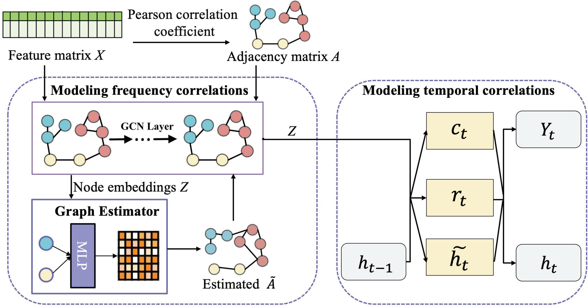

## Framework


## Motivation
In the real world of wireless communications, there usually exists **multi-band correlation** between adjacent bands, due to inevitable _power leakage_ from operating band to its adjacent bands. Meanwhile, the multi-band correlation also results from simultaneous _spectrum occupancy_ by the same transmitter over discontinuous bands. Such multi-band correlations can be represented as graph-structured spectrum data, in which the bands and their correlations are expressed as the nodes and edges in the graph. Considering these inherent patterns, it is crucial to exploit the implicit but important multi band correlations as well as their temporal dynamics across different bands in spectrum prediction tasks.

## Dataset
The dataset for this project comes from the open source platform: https://electrosense.org

| Dataset parameters            | Value                                    |
|-------------------------------|------------------------------------------|
| Dataset                       | Spectrum measurement data of ElectroSense |
| Dataset source                | https://electrosense.org                 |
| Sensor location               | Madrid, Spain                            |
| Frequency band                | 600 MHz–700 MHz                          |
| Monitoring time               | 6/1/2021 – 6/8/2021                      |
| Frequency resolution          | 2 MHz                                    |
| Time resolution               | 1 minutes                                |

**！！！The opening time of sensors on this platform is uncertain, and there may be some sensors shutdown.**

## Usage

### Requirements
- Python=3.8.20
- pytorch
- pytorch-lightning=1.8.2
- pandas
- scipy
- matplotlib

### Model training, vali and test
```
python train_main.py bcn_L --gpus 1
```
where "bcn_L" can be replaced by "rack_2", "test_rpi4" or "test_yago".


## Acknowledgement

We appreciate the following github repos a lot for their valuable code base or datasets of paper:
[T-GCN](https://github.com/lehaifeng/T-GCN/tree/master/T-GCN/T-GCN-PyTorch), [A-GCRNN](https://github.com/TLTLHILL/A-GCRNN-for-spectrum-prediction), [SAE-TSS](https://ieeexplore.ieee.org/abstract/document/10064355).


## Explanation

As we continuously iterate our models to publish new research findings, the original code of this paper was not promptly backed up upon completion. Instead, further model development and improvements were carried out based on it. Unfortunately, we are unable to fully restore the original version in a short time.  

To help readers quickly reproduce our work, we have carefully organized and provided this version of the code. We hope it will be helpful for your research.  

If you have any questions or suggestions regarding the code, please feel free to contact us:  
**Email:** dnyang26@gmail.com

## Reference
Please acknowledge the following paper if the codes and/or datasets are useful for your research.

```
@INPROCEEDINGS{10758056,
  author={Yang, Dong and Wang, Yue and Cai, Zhipeng and Li, Yingshu},
  booktitle={2024 IEEE 100th Vehicular Technology Conference (VTC2024-Fall)}, 
  title={Spectrum Prediction via Graph Structure Learning}, 
  year={2024},
  pages={1-5},
  doi={10.1109/VTC2024-Fall63153.2024.10758056}}
  ```
